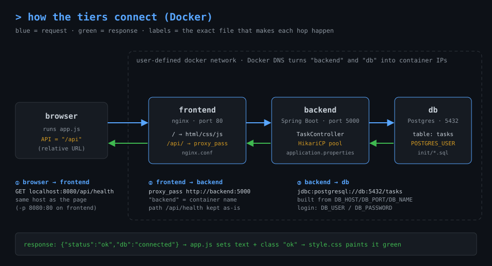
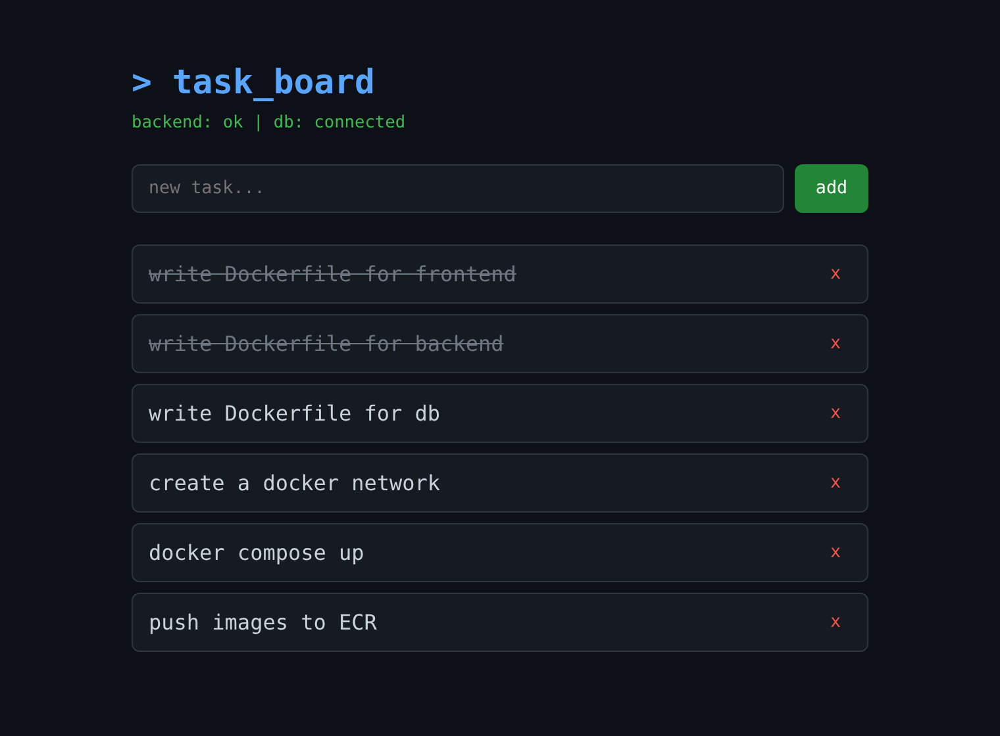

# three-tier-app

Task board: **nginx frontend → Spring Boot (Java 21) API → Postgres 16**.
Each folder is a self-contained Docker build context. Dockerfiles are yours to write.

```
three-tier-app/
├── frontend/                       → build context for the web image
│   ├── index.html
│   ├── style.css
│   ├── app.js
│   ├── nginx.conf                  → /etc/nginx/conf.d/default.conf
│   └── .dockerignore
│
├── backend/                        → build context for the API image
│   ├── pom.xml
│   ├── src/main/java/com/demo/tasks/
│   │   ├── TasksApplication.java
│   │   └── TaskController.java
│   ├── src/main/resources/
│   │   └── application.properties
│   ├── .env.example
│   └── .dockerignore
│
├── db/                             → build context for the database image
│   ├── init/
│   │   ├── 01-schema.sql           → /docker-entrypoint-initdb.d/
│   │   └── 02-seed.sql             → /docker-entrypoint-initdb.d/
│   ├── config/
│   │   └── postgresql.conf         → /etc/postgresql/postgresql.conf
│   ├── healthcheck.sh              → /usr/local/bin/healthcheck.sh
│   ├── .env.example
│   └── .dockerignore
│
└── docs/
    ├── architecture.svg            → connection diagram (used below)
    └── screenshot.png              → UI reference (not part of any image)
```

## How the tiers connect

**Analogy:** think of a restaurant.
- The **browser** is the customer. It only ever talks to the waiter.
- The **frontend** (nginx) is the waiter. It hands out the menu (HTML/CSS/JS) itself and carries anything starting with `/api/` to the kitchen.
- The **backend** (Spring Boot) is the kitchen. It turns the order into SQL.
- The **db** (Postgres) is the pantry, and only the kitchen has the key.

The customer never walks into the kitchen, and the waiter never opens the pantry.



### Link 1: frontend → backend (what makes the UI reach the API)

Three pieces make this link work.

**1. `frontend/app.js` uses a relative URL**

```js
const API = "/api";
fetch(`${API}/health`)          // → GET /api/health
```

There is no host or port in that URL, so the browser sends the request **to the same server that served the page**. If the page came from `localhost:8080`, the call goes to `localhost:8080/api/health`. Because of this, the JS never needs to know where the backend lives, and you never get CORS errors.

**2. `frontend/nginx.conf` forwards `/api/` to the backend**

```nginx
location /api/ {
    proxy_pass http://backend:5000;
}
```

- `location /api/`: any request path starting with `/api/` is forwarded. Everything else (`/`, `/app.js`, `/style.css`) is served from files on disk.
- `backend`: a **hostname**, not a keyword. Docker's built-in DNS resolves it to the backend container's IP. It only works if the container (or compose service) is named `backend` and sits on the same user-defined network.
- `:5000`: must equal `server.port` in `application.properties`.
- No trailing `/` after `5000`: nginx keeps the path as-is, so `/api/health` arrives at the backend as `/api/health`. With `proxy_pass http://backend:5000/;`, the `/api/` prefix would be stripped and every call would 404.

**3. `backend/.../TaskController.java` listens on that path**

```java
@RestController
@RequestMapping("/api")          // every method below is under /api
public class TaskController {
    @GetMapping("/health")       // → /api/health
```

**Consequence:** in Docker you only publish the **frontend** port (`-p 8080:80`). The backend's port 5000 never needs `-p`, because only nginx talks to it, over the internal network.

**Start order matters for nginx:** nginx looks up `backend` **once, when it starts**.
- If the backend container doesn't exist yet, nginx exits with `host not found in upstream "backend"`. Start the backend first, or use `depends_on` in compose.
- If you recreate the backend later and it gets a new IP, nginx still has the old IP cached and returns 502. Restart the frontend container to fix it.

**Running locally without Docker:** there's no nginx. Spring Boot serves `../frontend/` itself on port 5000, so the page and `/api/*` already share one origin and the relative URL still works. Same code, no proxy needed.

### How the health check works (end to end)

`checkHealth()` runs **once when the page loads**. Refresh the page to re-check.

```
app.js                    nginx                  TaskController.health()          Postgres
  │ GET /api/health  ───►   │ proxy_pass  ───►      │ borrow connection from pool  ───►  │
  │                         │                       │ c.isValid(2)  (2 s timeout)  ◄───  │
  │ ◄─── {"status":"ok","db":"connected"} ◄──────── │ return to pool                     │
  │
  └─► statusEl.textContent = "backend: ok | db: connected"
      statusEl.className   = "status ok"    →  style.css: .status.ok { color: green }
```

The backend's half (`TaskController.java`):

```java
try (Connection c = jdbc.getDataSource().getConnection()) {   // ask Hikari for a DB connection
    db = c.isValid(2) ? "connected" : "down";                 // ping Postgres, wait max 2 s
} catch (Exception e) {
    db = "down";                                              // DB unreachable / bad password / etc.
}
```

The frontend's half (`app.js`):

```js
const res  = await fetch(`${API}/health`);
const data = await res.json();                    // throws if the body isn't JSON
statusEl.textContent = `backend: ${data.status} | db: ${data.db}`;
statusEl.className   = data.db === "connected" ? "status ok" : "status err";
// catch → "backend: unreachable" (red)
```

**The 3 possible results and what each one proves:**

| Status line | What happened | Where to look |
|-------------|---------------|---------------|
| 🟢 `backend: ok \| db: connected` | All 3 hops work | Nothing to fix |
| 🔴 `backend: ok \| db: down` | Browser → nginx → backend works, **backend → db fails** | `DB_*` env vars, db container running, same network, password matches `POSTGRES_PASSWORD` |
| 🔴 `backend: unreachable` | `fetch` failed or got non-JSON. Usually nginx couldn't reach the backend and returned a `502 Bad Gateway` HTML page, so `res.json()` throws | Backend container name ≠ `backend`, backend not running/crashed, not on the same network, port ≠ 5000 |

### Link 2: backend → db (what makes the API reach Postgres)

Four pieces make this link work.

**1. `backend/pom.xml` puts the tools on the classpath**

```xml
spring-boot-starter-jdbc   → HikariCP connection pool + JdbcTemplate
postgresql                 → the JDBC driver that speaks Postgres' wire protocol
```

**2. `backend/src/main/resources/application.properties` says where and who**

```properties
spring.datasource.url=jdbc:postgresql://${DB_HOST:db}:${DB_PORT:5432}/${DB_NAME:tasks}
spring.datasource.username=${DB_USER:appuser}
spring.datasource.password=${DB_PASSWORD:apppass}
```

`${DB_HOST:db}` means: use the environment variable `DB_HOST` if it's set, otherwise use `db`. With no env vars, the URL becomes:

```
jdbc:postgresql://db:5432/tasks
                  │  │    └─ database name   (= POSTGRES_DB on the db container)
                  │  └────── port            (= port in db/config/postgresql.conf)
                  └───────── hostname        (= db container name, resolved by Docker DNS)
```

**3. Spring Boot auto-configuration wires it together (no code needed)**

On startup, Spring Boot sees the driver and the jdbc starter on the classpath. It:
1. builds a **HikariCP DataSource** from the `spring.datasource.*` properties,
2. wraps it in a **JdbcTemplate**,
3. injects that into `TaskController` through its constructor:

```java
public TaskController(JdbcTemplate jdbc) { this.jdbc = jdbc; }
```

Every query (`jdbc.queryForList(...)`, `jdbc.update(...)`) borrows a connection from the pool, runs the SQL, and returns the connection. It doesn't open a new connection per request.

Two pool settings control startup and failure behaviour:

```properties
spring.datasource.hikari.initialization-fail-timeout=-1   # start the app even if DB is down; connect lazily
spring.datasource.hikari.connection-timeout=3000          # a request waits max 3 s for a connection, then errors
```

So the backend container can start **before** the db is ready. `/api/health` reports `db: down` until Postgres accepts connections, then switches to `connected` without a restart.

**4. The db side accepts the connection**

- `db/config/postgresql.conf` has `listen_addresses = '*'`, so Postgres listens on the container's network interface, not just inside itself.
- `POSTGRES_USER` / `POSTGRES_PASSWORD` / `POSTGRES_DB` (env on the db container) create the login and database on first start. They **must equal** `DB_USER` / `DB_PASSWORD` / `DB_NAME` on the backend.
- `db/init/01-schema.sql` creates the `tasks` table. The backend **does not** create tables. If the init scripts didn't run, queries fail with `relation "tasks" does not exist` even though `/api/health` says `connected`.

### Values that must match (cheat sheet)

| This value | in file | must equal | in file / setting |
|------------|---------|------------|-------------------|
| `"/api"` | `app.js` | `location /api/` | `nginx.conf` |
| `/api` prefix | `nginx.conf` | `@RequestMapping("/api")` | `TaskController.java` |
| host `backend` | `nginx.conf` | backend container name | `docker run --name` / compose service |
| port `5000` | `nginx.conf` | `server.port=5000` | `application.properties` |
| `DB_HOST` (default `db`) | backend env | db container name | `docker run --name` / compose service |
| `DB_PORT` (default `5432`) | backend env | `port = 5432` | `postgresql.conf` |
| `DB_NAME` / `DB_USER` / `DB_PASSWORD` | backend env | `POSTGRES_DB` / `POSTGRES_USER` / `POSTGRES_PASSWORD` | db env |
| all three containers | | same user-defined network | `docker network create` / compose |

### Test each link separately (Docker)

When the status line is red, test the hops one at a time to find the broken one:

```bash
# Hop 1: browser → frontend. Should return the index.html source.
curl -s localhost:8080/ | head -5

# Hop 2: frontend → backend. Run inside the frontend container (nginx:alpine has wget).
docker exec <frontend-container> wget -qO- http://backend:5000/api/health
#   → {"status":"ok","db":"connected"}        hop 2 OK (and hop 3 too)
#   → "wget: bad address ..."                 DNS: wrong container name or not on the same network

# Hop 3: backend → db. Check the db itself from inside its container.
docker exec <db-container> pg_isready -U appuser -d tasks
#   → /var/run/postgresql:5432 - accepting connections
docker exec <db-container> psql -U appuser -d tasks -c "SELECT count(*) FROM tasks"

# Backend's own view of the DB (look for HikariPool / PSQLException errors)
docker logs <backend-container> | grep -iE "hikari|psql|connection"

# Who is on the network?
docker network inspect <network> --format '{{range .Containers}}{{.Name}} {{end}}'
```

## Run locally (no Docker)

Locally there's no nginx: Spring Boot serves the `frontend/` folder itself, so UI and API share one origin on **http://localhost:5000**.

```
 browser ──► localhost:5000 ──► Spring Boot ──┬── /          → files from ../frontend/
                                              └── /api/*     → TaskController ──► Postgres :5432
```

### 1. Install prerequisites

| Tool | Version | Get it |
|------|---------|--------|
| PostgreSQL | 16 | postgresql.org/download (Windows installer includes `psql`) |
| JDK | 21 | adoptium.net (Temurin 21) |
| Maven | 3.9+ | maven.apache.org/download.cgi |

Check:

```powershell
psql --version     # psql (PostgreSQL) 16.x
java -version      # openjdk version "21.x"
mvn -v             # Apache Maven 3.9.x
```

### 2. Create the database

Run from the project root. You'll be prompted for the `postgres` superuser password you set during install.

**Windows (PowerShell)**

```powershell
psql -h localhost -U postgres -c "CREATE USER appuser WITH PASSWORD 'apppass';"
psql -h localhost -U postgres -c "CREATE DATABASE tasks OWNER appuser;"

$env:PGPASSWORD = "apppass"
psql -h localhost -U appuser -d tasks -f db/init/01-schema.sql
psql -h localhost -U appuser -d tasks -f db/init/02-seed.sql
```

**Linux / macOS (bash)**

```bash
sudo -u postgres psql -c "CREATE USER appuser WITH PASSWORD 'apppass';"   # macOS Homebrew: drop "sudo -u postgres", use: psql postgres -c ...
sudo -u postgres psql -c "CREATE DATABASE tasks OWNER appuser;"

export PGPASSWORD=apppass
psql -h localhost -U appuser -d tasks -f db/init/01-schema.sql
psql -h localhost -U appuser -d tasks -f db/init/02-seed.sql
```

Expected output:

```
CREATE ROLE
CREATE DATABASE
CREATE TABLE
CREATE INDEX
INSERT 0 5
```

> `db/config/postgresql.conf` and `healthcheck.sh` are for the Docker image only. A local install uses its own config.

### 3. Start the backend (also serves the frontend)

**Windows (PowerShell)**

```powershell
cd backend
$env:DB_HOST = "localhost"
mvn spring-boot:run "-Dspring-boot.run.arguments=--spring.web.resources.static-locations=file:../frontend/"
```

**Linux / macOS (bash)**

```bash
cd backend
DB_HOST=localhost mvn spring-boot:run \
  -Dspring-boot.run.arguments="--spring.web.resources.static-locations=file:../frontend/"
```

`DB_HOST=localhost` is required. The default (`db`) is the Docker container name and won't resolve locally. Other `DB_*` defaults already match step 2.

First run downloads dependencies (1–3 min). Expected output (timestamps/PIDs trimmed):

```
  :: Spring Boot ::                (v3.3.4)

INFO  Starting TasksApplication using Java 21 ...
INFO  Tomcat initialized with port 5000 (http)
INFO  Root WebApplicationContext: initialization completed in 812 ms
INFO  Adding welcome page: URL [file:../frontend/index.html]
INFO  Tomcat started on port 5000 (http) with context path '/'
INFO  Started TasksApplication in 2.3 seconds (process running for 2.6)
```

When the first request hits the DB you'll also see `HikariPool-1 - Start completed.`

Leave this terminal running. `Ctrl+C` stops it.

### 4. Open the app

Go to **http://localhost:5000**



What you should see:

- Status line **green**: `backend: ok | db: connected`
- The 5 seeded tasks (the screenshot has 2 marked done and 1 added)
- **Type + `add`** creates a task · **click a task** toggles done (strike-through) · **`x`** deletes it
- Refresh the page: changes persist (they're in Postgres)

### 5. Check the API directly (optional)

Use `curl.exe` on Windows (plain `curl` in PowerShell 5 is an alias for `Invoke-WebRequest`).

```bash
curl -s http://localhost:5000/api/health
```
```json
{"status":"ok","db":"connected"}
```

```bash
curl -s http://localhost:5000/api/tasks
```
```json
[{"id":1,"title":"write Dockerfile for frontend","done":false,"created_at":"2026-10-03T16:01:12.345+00:00"},{"id":2,"title":"write Dockerfile for backend","done":false,"created_at":"2026-10-03T16:01:12.345+00:00"}, ...]
```

Write calls (bash; on Windows use the UI for these, since JSON quoting in PowerShell is painful):

```bash
curl -s -X POST  localhost:5000/api/tasks   -H "Content-Type: application/json" -d '{"title":"learn docker"}'
# → 201  {"id":6,"title":"learn docker","done":false,"created_at":"..."}

curl -s -X PATCH localhost:5000/api/tasks/6 -H "Content-Type: application/json" -d '{"done":true}'
# → 200  {"id":6,"title":"learn docker","done":true,"created_at":"..."}

curl -s -o /dev/null -w "%{http_code}\n" -X DELETE localhost:5000/api/tasks/6
# → 204
```

### Troubleshooting

| You see | Cause | Fix |
|---------|-------|-----|
| Status red: `backend: unreachable` | Backend not running, or you opened `index.html` by double-click (`file://`) | Start step 3, use `http://localhost:5000` |
| Status red: `db: down` | `DB_HOST` not set to `localhost`, Postgres service stopped, or wrong password | Set `DB_HOST`, start Postgres, re-check step 2 |
| `Port 5000 was already in use` | Another app on 5000 (macOS: AirPlay Receiver) | Add `--server.port=5050` to the run arguments, open `localhost:5050` |
| Page loads but no styling/JS | Wrong `static-locations` path | Run the command from inside `backend/`, keep the trailing `/` in `file:../frontend/` |
| `relation "tasks" does not exist` | Init scripts not run | Re-run the two `psql -f` lines in step 2 |

## Docker: what each image needs

| Image    | Base image | Port | Build / run |
|----------|------------|------|-------------|
| frontend | `nginx:alpine` | 80 | Copy html/css/js → `/usr/share/nginx/html/`, `nginx.conf` → `/etc/nginx/conf.d/default.conf` |
| backend  | build `maven:3.9-eclipse-temurin-21`, run `eclipse-temurin:21-jre` | 5000 | `mvn package -DskipTests` → `target/app.jar`, run `java -jar app.jar` |
| db       | `postgres:16-alpine` | 5432 | Copy `init/` → `/docker-entrypoint-initdb.d/`, `config/postgresql.conf` → `/etc/postgresql/`, `healthcheck.sh` → `/usr/local/bin/`. Start with `postgres -c config_file=/etc/postgresql/postgresql.conf` |

## Env vars (see each folder's `.env.example`)

| Image   | Vars |
|---------|------|
| db      | `POSTGRES_DB=tasks` `POSTGRES_USER=appuser` `POSTGRES_PASSWORD=apppass` |
| backend | `DB_HOST=db` `DB_PORT=5432` `DB_NAME=tasks` `DB_USER=appuser` `DB_PASSWORD=apppass` |

Backend defaults already match, so env vars are optional unless you change them.

## Gotchas

- **Names**: nginx proxies `/api/` to `http://backend:5000`. Backend connects to host `db`. Container names (or compose service names) must be `backend` and `db`.
- **Network**: all three on one user-defined network (`docker network create`). The default bridge has no DNS.
- **Init scripts run once**: only when the data volume is empty. Changed the SQL? `docker volume rm` it.
- **Backend multi-stage**: copy `pom.xml` → `mvn dependency:go-offline` → copy `src/` → `mvn package`. The dependency layer gets cached and the final JRE image is ~250 MB instead of ~800 MB.
- **Backend start order**: the API starts even if the db isn't ready. Status line shows `db: down` until Postgres is up.

## API

| Method | Path | Body |
|--------|------|------|
| GET    | /api/health     | – |
| GET    | /api/tasks      | – |
| POST   | /api/tasks      | `{"title": "..."}` |
| PATCH  | /api/tasks/{id} | `{"done": true}` |
| DELETE | /api/tasks/{id} | – |

## Done when

Open `http://localhost:<frontend-port>` → status line green (`db: connected`) and 5 seeded tasks show.
